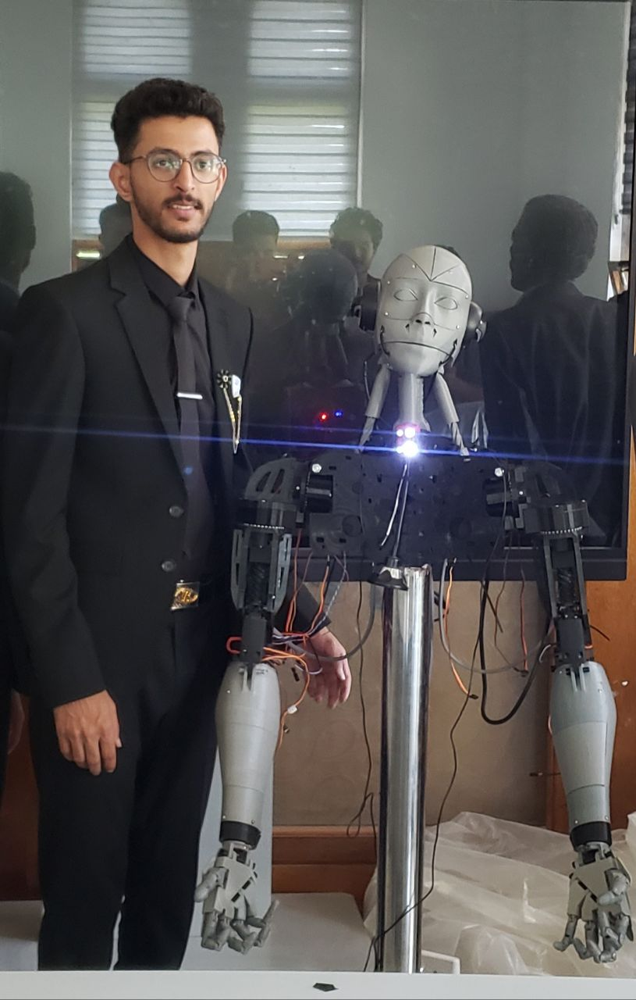
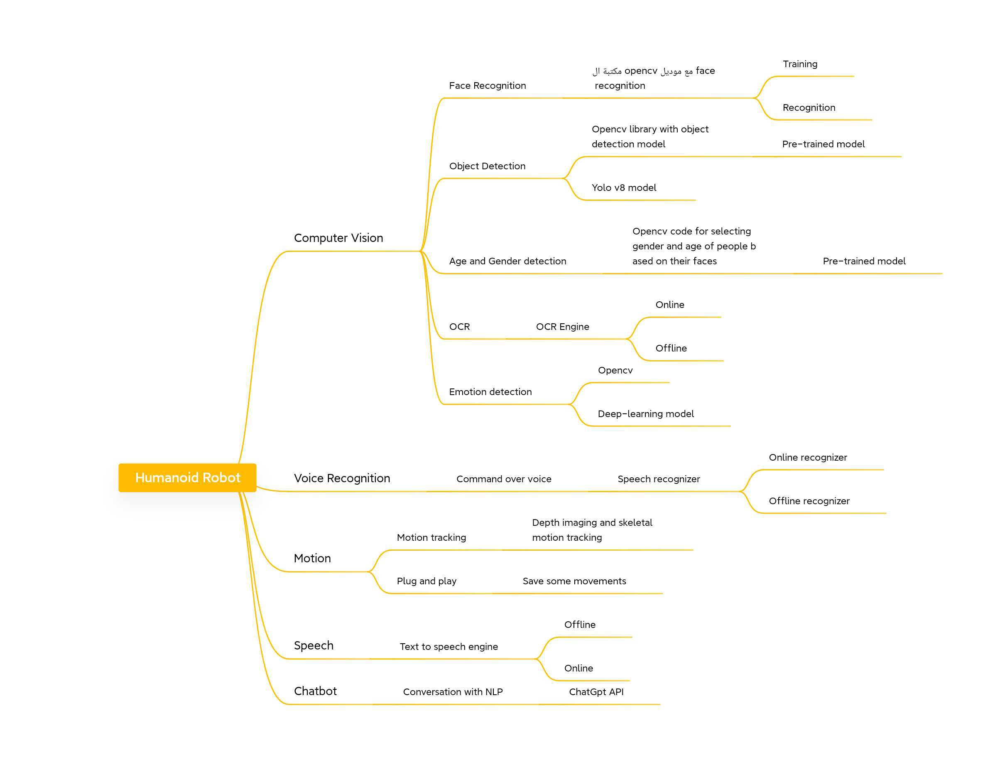
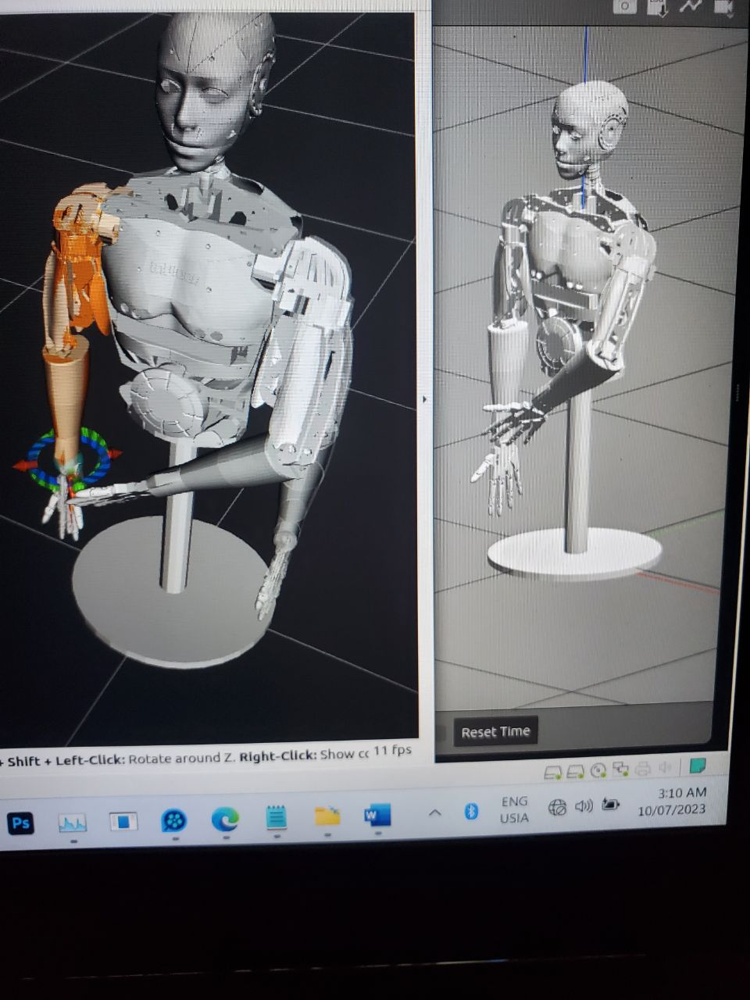

# 🤖 Humanoid Robot Project

<!-- Add a hero image of your robot here -->
<p align="center">
  
</p>


---

## 📌 Project Overview
The **Humanoid Robot Project** is an open-source initiative designed to integrate **artificial intelligence, robotics, and human interaction**.  
This robot can see, listen, speak, move, and engage in natural conversations thanks to the combination of **ROS (Robot Operating System)**, **computer vision**, **voice recognition**, and **chatbot technologies**.

The goal of this project is to build an affordable and modular humanoid robot that can be used for:
- Human-robot interaction research  
- Education and robotics learning  
- AI + Robotics integration experiments  
- Personal assistant and service robot applications  
<p align="center">
  
</p>

---

## 🛠️ Hardware Components
The humanoid robot is built using the following hardware:

1. **Raspberry Pi 4B (4GB RAM)** – Main controller running **ROS** and managing all robot functionalities.  
2. **ESP32 Microcontroller** – Controls servo motors and converts Raspberry Pi commands into precise movements.  
3. **MG996R Servo Motors** – High-torque motors used to actuate robot joints.  
4. **Kinect One Sensor** – Depth-sensing camera for vision, face recognition, emotion detection, and motion tracking.  
5. **Speakers & Microphone** – Enable natural voice interaction with the robot.  
6. **3D Printed Parts** – The robot body, arms, and legs are constructed using CAD designs and 3D printing.  

👉 Full details are available in the [Hardware Documentation](docs/hardware.md).

---

## 🔗 ROS Integration
The project uses **ROS (Robot Operating System)** as the middleware that connects all components:  

- Manages communication between sensors, controllers, and actuators  
- Publishes/subscribes to ROS topics like `/movement_name`, `/gpt_reply`, `/status`, etc.  
- Bridges messages between **ROS nodes** and external services via **MQTT**  
- Enables modular and scalable development for robotic applications  

> Example: The Raspberry Pi runs ROS to integrate **vision, speech recognition, motion tracking, and chatbot services** into a unified system.




---

## 🧠 Features Breakdown

### 🔍 Computer Vision
- **Face Recognition** – Detect and recognize faces with OpenCV & ML models  
- **Object Detection** – YOLOv8 + OpenCV pre-trained models  
- **Age & Gender Detection** – Classify people demographics based on face features  
- **Emotion Detection** – Deep learning model to detect emotions  
- **OCR (Optical Character Recognition)** – Read text from images (online & offline)  


---

### 🎤 Voice Recognition
- Recognize and process spoken commands  
- **Online & Offline recognizers** available  


---

### 🕺 Motion
- **Depth imaging & skeletal motion tracking**  
- Save and replay robot movements  
[


---

### 🗣️ Speech
- **Text-to-Speech (TTS)** engine for natural robot speech  
- Works both **offline** and **online**  

!

---

### 💬 Chatbot
- Integrated with **ChatGPT API**  
- Handles questions, casual conversations, and interactive tasks  

!
---

## 🚀 Getting Started

### 1️⃣ Clone the repository
```bash
git clone https://github.com/your-username/humanoid-robot.git
cd humanoid-robot
