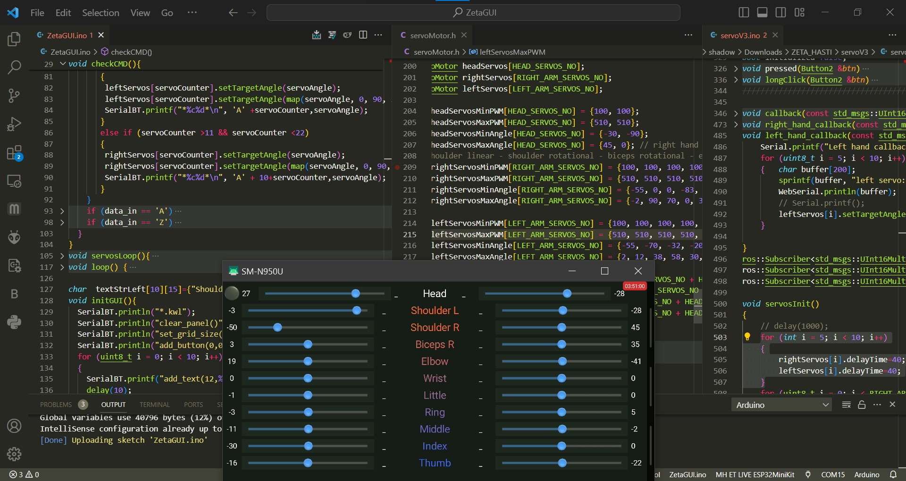
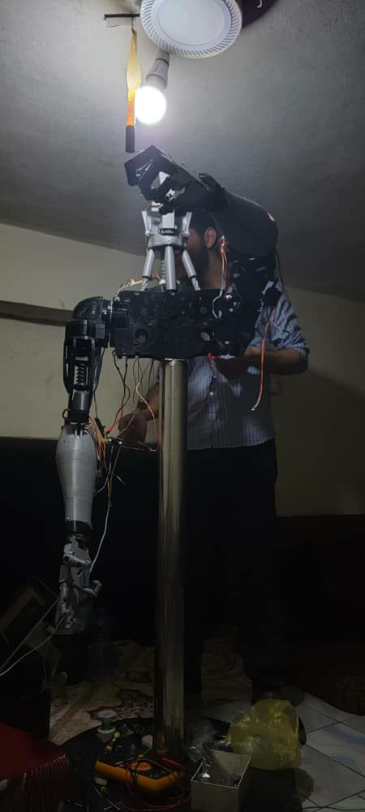
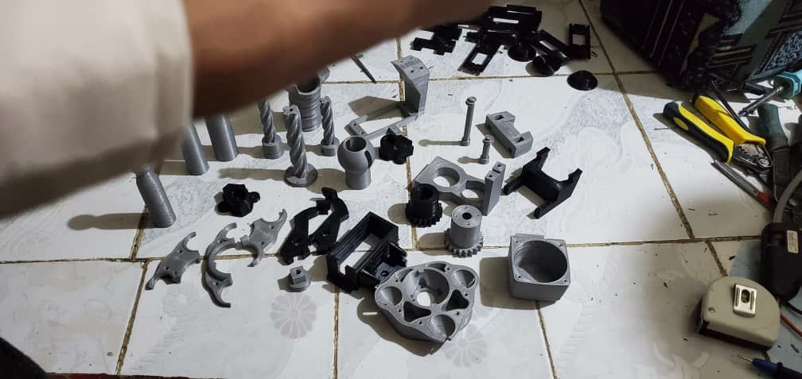
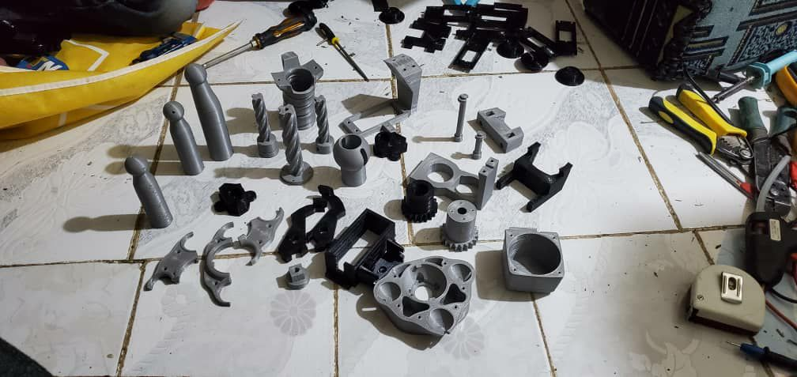

# 🛠️ Hardware Documentation

This document describes the hardware components used in the **Humanoid Robot Project**.

---

## 📌 Main Components

### 1. Raspberry Pi 4B (4GB RAM)
- Quad-core ARM Cortex-A72 CPU  
- 4GB RAM  
- Supports Wi-Fi and Bluetooth  
- Runs **ROS (Robot Operating System)**  
- Acts as the **main controller** for the robot, managing vision, motion, and AI modules.  

---

### 2. ESP32 Microcontroller
- Dual-core Tensilica LX6 CPU, 520KB RAM  
- Supports Wi-Fi and Bluetooth  
- Communicates with Raspberry Pi via **SPI protocol**  
- Converts Raspberry Pi commands into **servo motor movements**  

---

### 3. MG996R Servo Motors
- High-torque, metal-geared servo motors  
- Used for moving robot joints (arms, legs, head, etc.)  
- Controlled by the ESP32 microcontroller  
- Provide precise and smooth movements  

---

### 4. Kinect One Sensor
- Depth-sensing camera with high-resolution RGB camera  
- Infrared sensors for detecting depth and skeletal movement  
- Used for:
  - Object detection  
  - Face recognition  
  - Emotion & gender recognition  
  - Skeletal tracking  

  

---

### 5. Speakers & Microphone
- Connected to Raspberry Pi  
- Enable **voice interaction** and natural conversations  
- Used for both speech recognition and text-to-speech  

---

### 6. 3D Printed Parts
- Robot body, arms, and legs are designed with **CAD software**  
- Printed using a **3D printer**  
- Provide the humanoid form of the robot  

  
  
  

---

## ⚙️ Summary
The hardware setup integrates:  
- **Raspberry Pi** (main controller with ROS)  
- **ESP32** (motor controller)  
- **Servo Motors** (actuation)  
- **Kinect Sensor** (vision & motion tracking)  
- **Speakers & Microphone** (voice I/O)  
- **3D Printed Body**  

Together, these components enable the robot to perform **vision, speech, motion, and interaction tasks** seamlessly.
